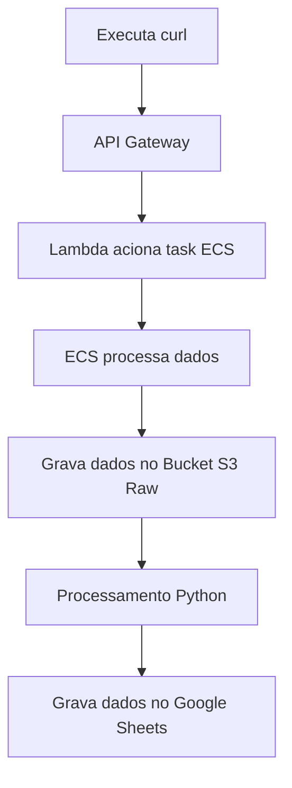

# my money family

## Estrutura do projeto

### 1. python

estrutura medallion 

    - admin/raw/src
    - admin/process/src

gerar image docker e dar puhs na AWS
    - admin/raw/deploy_docker_ecs.sh

### 2. terraform

cria recursos na nuvem

    - aws/medalion(S3) -> gerar primeiro os buckets no S3
    - aws/ecs -> gerar tasks no ecs e push da image nos repo da aws
    - aws/lambda -> gerar lmabda que recebe requisição
    



### 3. execução

Execução do processo na AWS via Tasks ECS, acionado pelo lambda.

<aside>
💡

Atualizar xls:

```
    aws s3 cp "path-local" "s3://medalion-cust/raw/original/" --recursive --exclude "*" --include "custo_2025_09.xls"
```

executado via curl que aciona lambda *raw*

```
    curl -X POST "https://0cgzijkxda.execute-api.us-east-1.amazonaws.com/run"
```

aciona um task no ECS

*necessario dar acesso ao ecs para manipular s3://medalion-cust

executado via crul lambda aciona lambda *process*

```
    curl -X POST "https://blgfx6i8j3.execute-api.us-east-1.amazonaws.com/run"
```

</aside>
