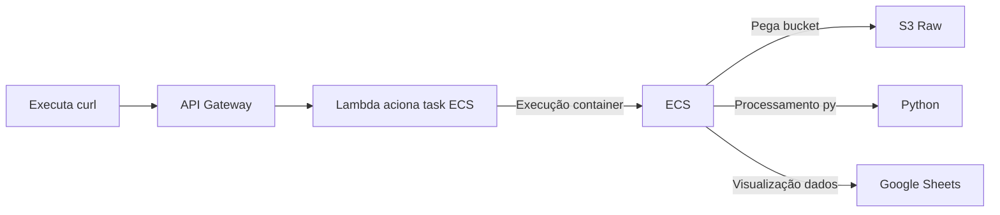

# my money family

## Estrutura do projeto

### Container do Docker na AWS 🐋

estrutura medallion 

    - admin/raw/src
    - admin/process/src

executa dentro de cada etapa do medalhao, criação do container e gerar na aws:
    - raw/deploy_docker_ecs.sh
    - process/deploy_docker_ecs.sh

### Terraform 🦔

cria recursos na nuvem

    - aws/ecs
    - aws/ec2
    - aws/lambda
    - aws/medalion(S3)

### Execução ✈️

Execução do processo na AWS via Tasks ECS, acionado pelo lambda.

<aside>
💡

executado via endpoint - aciona tarefa do ecs via lambda.

*curl -X POST "https://4ebtfw1bec.execute-api.us-east-1.amazonaws.com/run"*

</aside>
