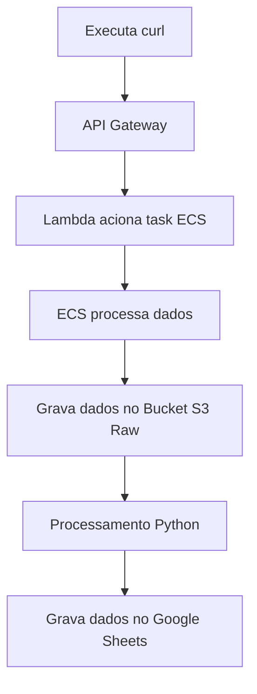

# my money family

## Estrutura do projeto

### 1. python

estrutura medallion 

    - admin/raw/src
    - admin/process/src

gerar image docker e dar puhs na AWS
    - admin/raw/deploy_docker_ecs.sh

### 2. terraform

cria recursos na nuvem

    - aws/ecs
    - aws/ec2
    - aws/lambda
    - aws/medalion(S3)

### 3. execução

Execução do processo na AWS via Tasks ECS, acionado pelo lambda.

<aside>
💡

executado via curl que aciona lambda

*curl -X POST "https://4ebtfw1bec.execute-api.us-east-1.amazonaws.com/run"*

aciona um task no ECS

*necessario dar acesso ao ecs para manipular s3://medalion-cust

</aside>
