# my money family

## Estrutura do projeto

### Container do Docker na AWS 🐋

estrutura medallion 

    - admin/raw/src
    - admin/process/src

executa dentro de cada etapa do medalhao, criação do container e gerar na aws:
    - raw/deploy_docker_ecs.sh
    - process/deploy_docker_ecs.sh

### Terraform 🦔

cria recursos na nuvem

    - aws/ecs
    - aws/ec2
    - aws/lambda --> executar zip para compacatr pasta src:
                        zip -r ../lambda.zip . | unzip -g lambda_code.zip lambda_function.py
                        no arquivo consta somente os .py
    - aws/medalion(S3)

### Execução ✈️

Execução do processo na AWS via Tasks ECS, acionado pelo lambda.

<aside>
💡

executado via endpoint - aciona tarefa do ecs via lambda.

*curl -X POST "https://0cgzijkxda.execute-api.us-east-1.amazonaws.com/run"*
curl -X POST "https://0cgzijkxda.execute-api.us-east-1.amazonaws.com/run" \
  -H "Content-Type: application/json" \
  -d '{"ano": "2025"}'

```mermaid
graph LR;
    A[Executa curl] --> B[API Gateway];
    B --> C[Lambda aciona task ECS];
    C -- Execução container --> D[ECS];
    D -- Pega bucket --> E[S3 Raw];
    D -- Processamento py --> F[Python];
    D -- Visualização dados --> G[Google Sheets];
```

</aside>

